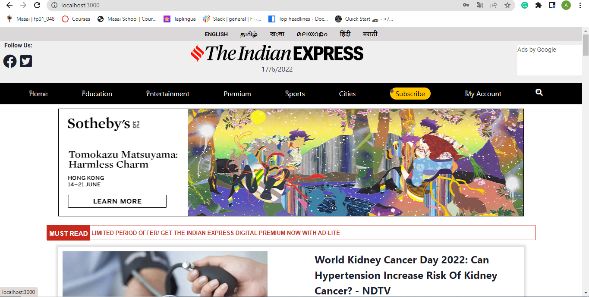
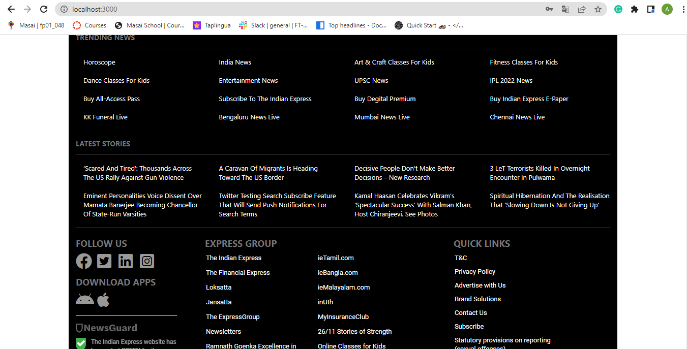
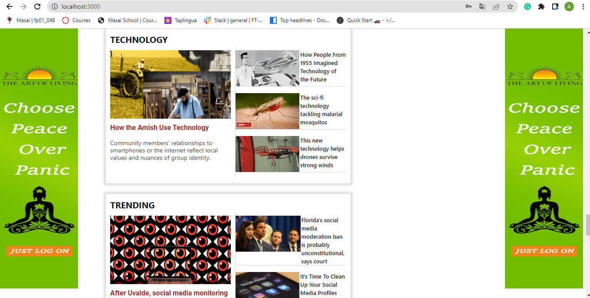
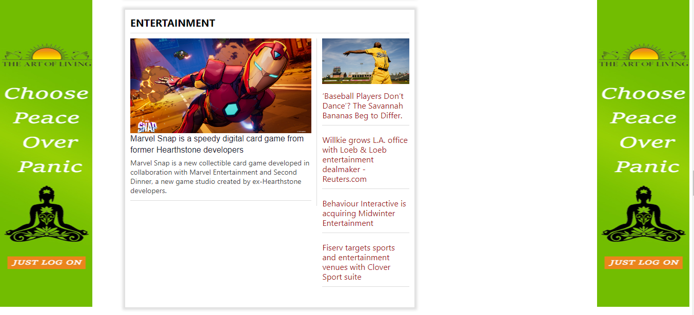
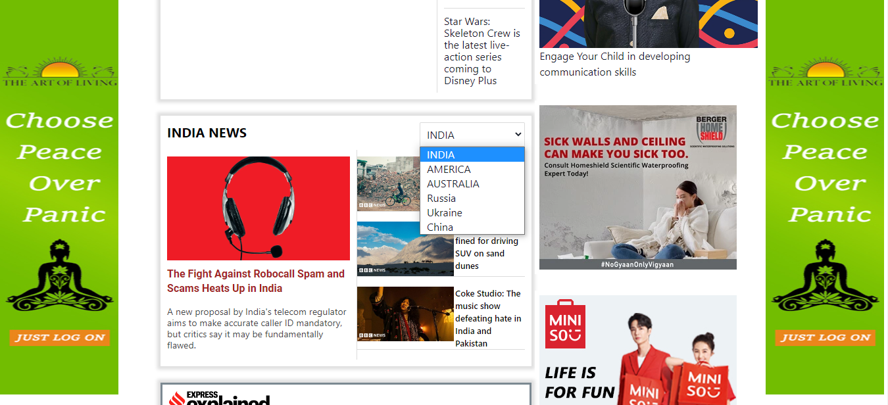
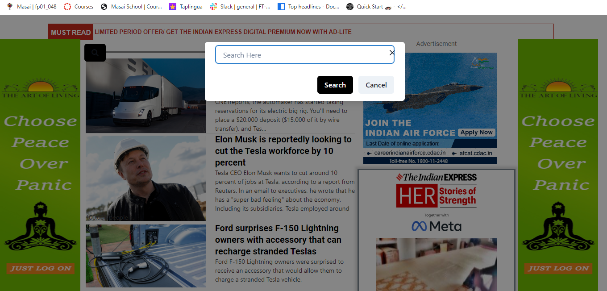
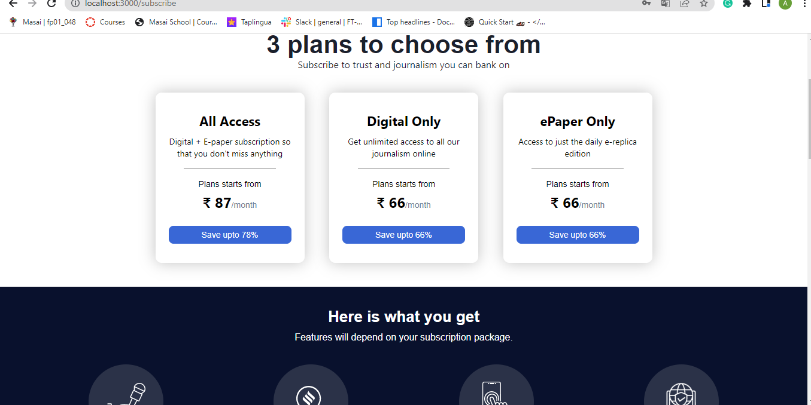
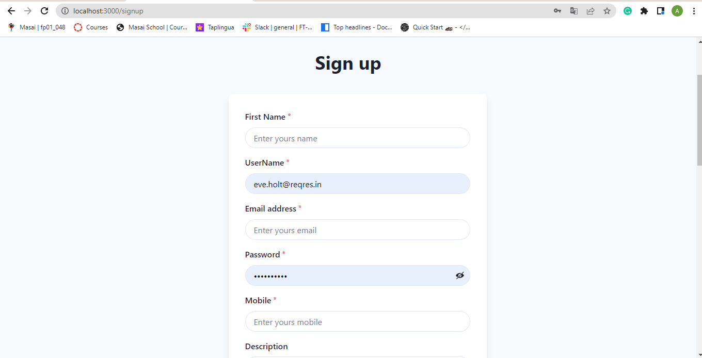
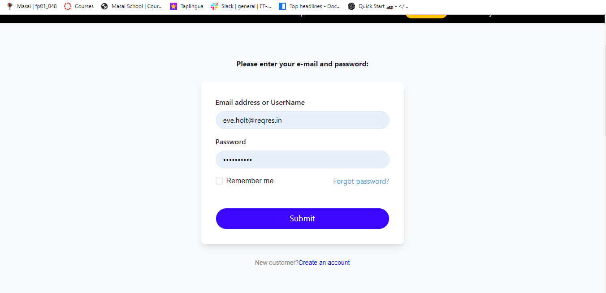

# The-Indian-Express-Clone
Single project from react, react-redux
__________________________
Project: Make a clone of https://indianexpress.com/

In this project I have tried to clone The Indian Express website, Styling using CSS,CHAKRA UI and tried to make website more dynamic and responsive. With the knowledge and the technology that I have learned in RCT-121 course in the Masai School, I was able to clone the website in 6 days with the same looking and some features.

# Technology Stack Used 🌟
•	REACT
•	REDUX
•	HTML
•	CSS
•	JavaScript
•	CHAKRA UI
   
# The Data was fetch by News Api due to which the site can be run only in local-host
Snapshots 📷
•	 page (Home page)

 
 

•	Categories Part

 
 

  
•	Country Select

 
  
•	Search Page

 

•	Subscription

 
  
•	Signup & Login Page

 
 

# How to run the Project
### `npm start`

•	Runs the my-app in the development mode.\
Open [http://localhost:3000](http://localhost:3000) to view it in your browser.

The page will reload when you make changes.\
You may also see any lint errors in the console.
•	Type 'npm install' for downloading dependencies.
•	Type 'npm start' in your terminal and you are good to go.

# End Notes 📑
In this project I have tried to  clone  the original website as much as possible. This entire journey of this Unit construct week has given me 
experiences and I have learned lots of things about REACT, REDUX by applying to the real website and it gave me a lot more confidence in the REACT framework and especially in REDUX Most of the features are added and functionality of the website are achieved.

# Limitations
Pages are not responsive yet and all the pages are not dynamic also, those pages might not be properly visible on small screen devices as i was given only 6 days to clone the website and due to the News Api my website cant be deploy because this api only allow us to work in local host.

